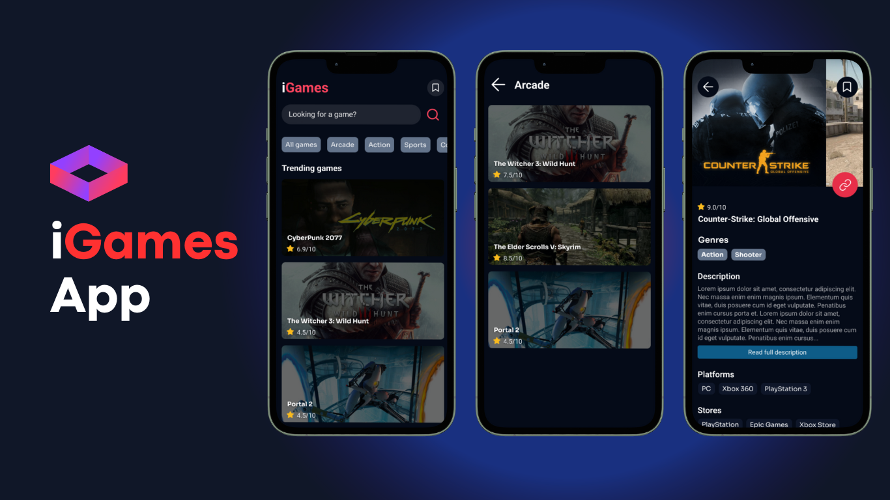
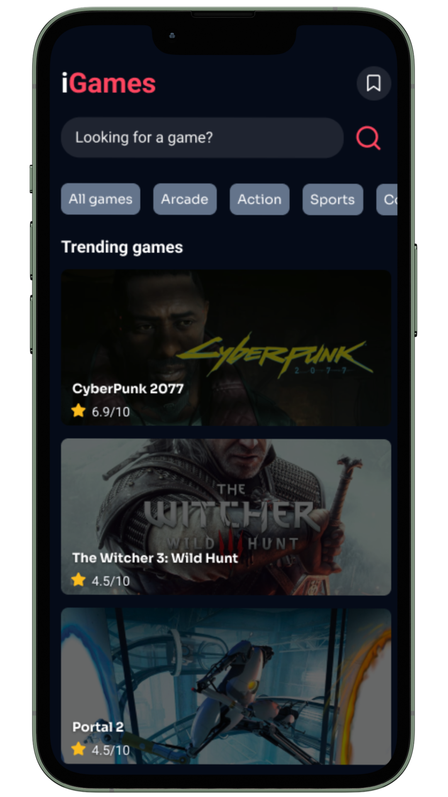
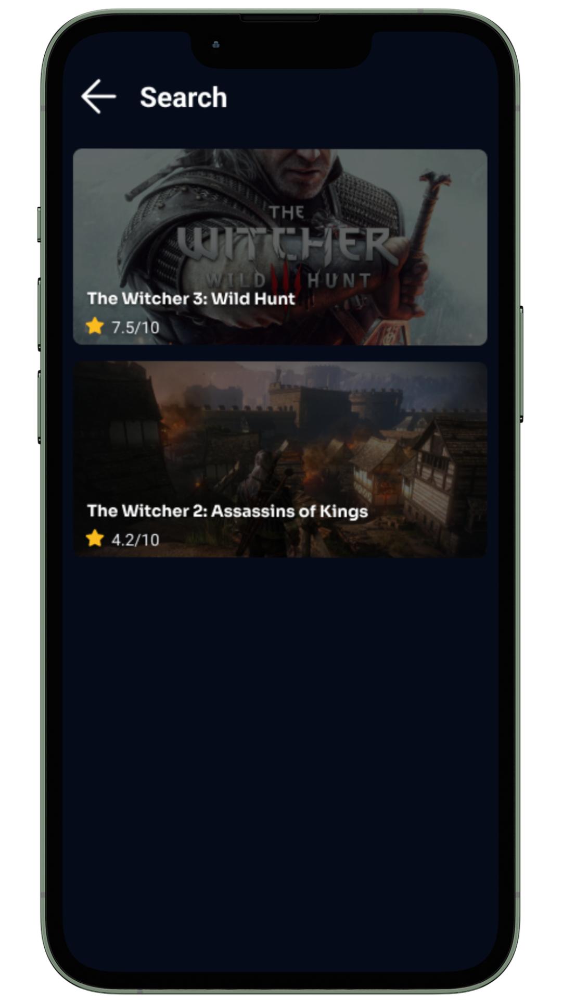
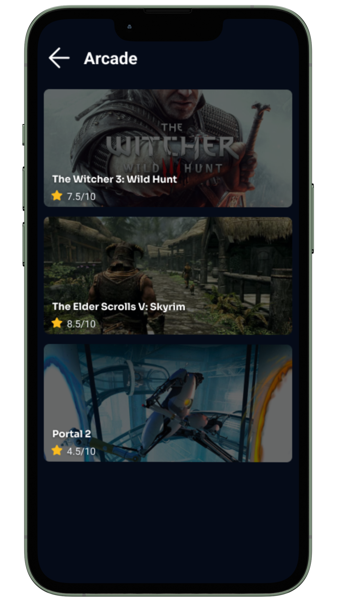
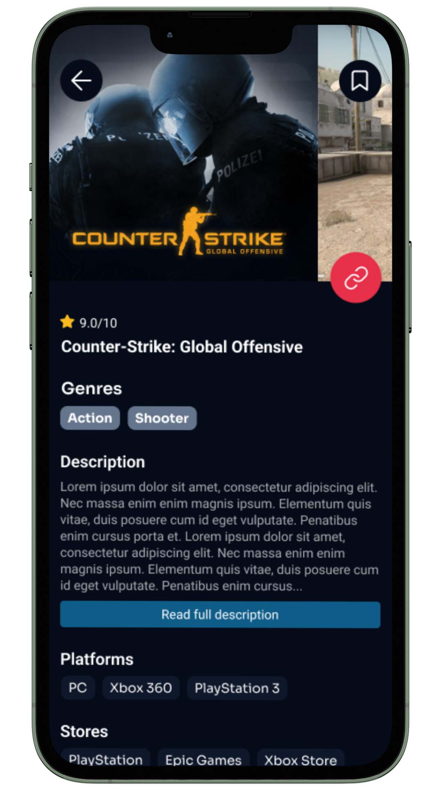
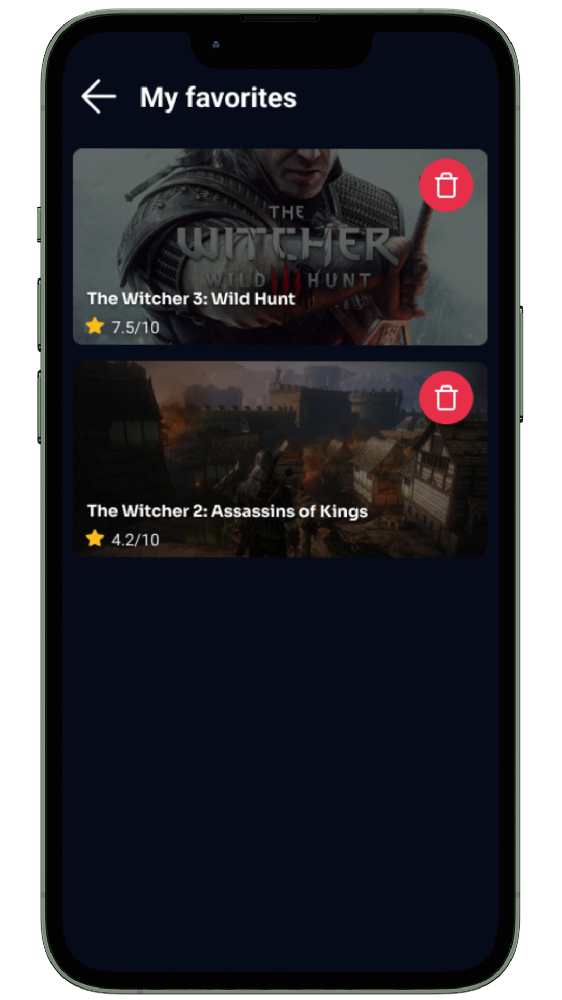

<p align="center">
  

  
  
  <a href="https://github.com/lucashs94/React_Native_-_iGames/commits/master">
    
  </a>
</p>
<br>

<h1 align="center">
    
</h1>

<h2 align="center"> 
	iGames - Seu App Game mais completo
</h2>
<br>

<p align="center">
 <a href="#-sobre-o-projeto">Sobre</a> •
 <a href="#-layout">Layout</a> • 
 <a href="#-funcionalidades">Funcionalidades</a> •
 <a href="#-como-executar-o-projeto">Como executar</a> • 
 <a href="#-tecnologias">Tecnologias</a> • 
 <a href="#-autor">Autor</a>
</p>
<br>

## 💻 Sobre o projeto

<br>

**iGames** é um app de consulta que utiliza a API da [RAWG](https://rawg.io/apidocs) para trazer informações sobre GAMES.  
<br>
<br>


---

## 🎨 Layout

O layout da aplicação está disponível no Figma:
<p>

  <a href="https://www.figma.com/file/1SxgOMojOB2zYT0Mdk28lB/Ecoleta?node-id=136%3A546">
    
  </a>
</p>
<br>


### Telas

<p align="center">
  
  
  
  
  
</p>
<br>

---

## ⚙️ Funcionalidades

**TELA HOME**
  - [x] Tela principal, contendo:
    - [x] Listagem dos trending Games
      - Ao clicar nos games, acessa a tela de datlhes sobre o game escolhido
    - [x] Busca de games pelo nome
      - Digitando o nome e clicando na busca, acessa a tela de SEARCH trazendo todo os GAMES que contem o termo buscado
    - [x] Bookmark para acessar os favoritos do usuario (salvo em localStorage)
    - [x] Listagem das categorias dos Games.
      - Ao clicar na categoria, acessa a tela de categorias trazendo todos os games da categoria escolhida
<br>

**TELA DETAILS**
  - [x] Tela de datlhes do jogo, contendo:
    - [x] Caroussel de fotos (arrastando lateralmente)
    - [x] Informações do Game
      - (Avaliação, Nome, Descrição, PLataformas e Lojas)
    - [x] Botão para descrição maior
      - Ao clicar, abre uma bottom Sheet contendo a descricao inteira
<br>

**TELA SEARCH**
  - [x] Tela de busca, contendo:
    - [x] Todos os games encontrados pelo termo buscado
<br>

**TELA CATEGORIES**
  - [x] Tela de busca por categoria, contendo:
    - [x] Todos os games encontrados pela categoria escolhida
<br>

**TELA FAVORITES**
  - [x] Tela de Favoritos, contendo:
    - [x] Todos os games salvos pelo usuário


<br>

---

## 🚀 Como executar o projeto

<p>
  💡 Este projeto utiliza o EXPO CLI como ferramenta de desenvolvimento, portanto é preciso ter o EXPO instalado na máquina. 
</p>


### Pré-requisitos

Antes de começar, você vai precisar ter instalado em sua máquina as seguintes ferramentas:
  - [Git](https://git-scm.com)
  - [Node.js](https://nodejs.org/en/) 
  - [VSCode](https://code.visualstudio.com/)

<br>

### 🎲 Rodando o Projeto

 
**Clone este repositório**

```bash
  
git clone https://github.com/lucashs94/React_Native_-_iGames.git
  
```
 
**Acesse a pasta do projeto**

```bash
  
cd React_Native_-_iGames
  
```
 
**Instale as dependências**

```bash
  
npm install
  
```
 
**Altere o arquivo .env**

```bash
  
cp .env.exampe .env
nano .env
  
```
 
**Rode o projeto com Expo limpando o cache**

```bash
  
npx expo start --clear
  
```
<br>

---  

## ✨ Tecnologias

-   [X] React Native
-   [X] Typescript
-   [X] Styled Components
-   [X] React Native Bottom Sheet (@horhom)
-   [X] Expo
-   [X] Async Storage
-   [X] Vector Icons
-   [X] Axios
-   [X] Expo Google Fonts
-   [X] Expo Splash Screen
-   [X] React Navigation
-   [X] React Native Gesture Handler
-   [X] React Native Reanimated
-   [X] React Native Safe Area Context


> Veja o arquivo  [package.json](https://github.com/lucashs94/React_Native_-_iGames/blob/main/package.json)
<br>

---

## 🦸 Autor

<a href="https://blog.rocketseat.com.br/author/thiago/">
 
 <br />
<!--  <sub><b>Thiago Marinho</b></sub></a> <a href="https://blog.rocketseat.com.br/author/thiago/" title="Rocketseat">🚀</a> -->
 <br />

<!---[](https://twitter.com/tgmarinho) -->
[](https://www.linkedin.com/in/lucashs94/) <br>
[](mailto:h7.lucas@gmail.com)

